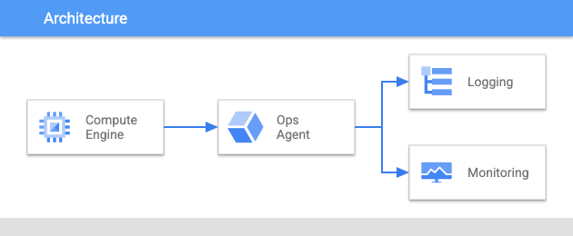

# Deploy Stack - Jump Server with Ops Agent 

This stack creates a Compute Engine Instance and installs the Ops Agent on it. Also it will install necessary packages for supporting the actual SAP stack deployment process

## Install
You can install this application using the `Open in Google Cloud Shell` button 
below. 

Clicking this link will take you right to the DeployStack app, running in your 
Cloud Shell environment. It will walk you through setting up your architecture.  

## Cleanup 
To remove all billing components from the project
1. Typing `deploystack uninstall`
